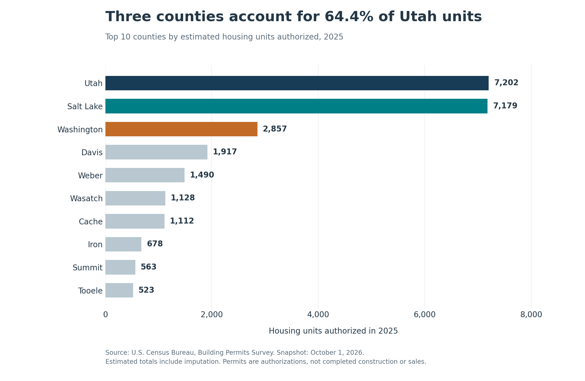

# Utah Residential Construction Market Analysis

**Where should a residential construction supplier focus its next round of market research?**

This portfolio case study compares all 29 Utah counties using U.S. Census Bureau residential building permit data. It combines Excel validation, SQL analysis, Python checks, and clear market comparisons to support a shortlist for further investigation.

## Recommendation

Investigate **Utah, Salt Lake, and Washington counties** first. Together they account for **64.4% of Utah's 2025 permitted housing units**. These same three counties lead on both 2025 units and the 2023–2025 annual average, although Salt Lake leads on the average and Utah leads in 2025.

| County | 2025 units | Share of Utah | Change from 2024 | 2023–2025 annual average | 2025 single-family share |
| --- | ---: | ---: | ---: | ---: | ---: |
| Utah | 7,202 | 26.9% | +13.9% | 6,520 | 73.9% |
| Salt Lake | 7,179 | 26.8% | +57.8% | 6,681 | 35.9% |
| Washington | 2,857 | 10.7% | −9.4% | 2,943 | 87.4% |

- **Utah County:** the largest 2025 market, with 5,324 single-family units and a predominantly single-family mix. Prioritize understanding local homebuilder purchasing and delivery needs.
- **Salt Lake County:** nearly equal 2025 scale and the largest recent annual average. Its 64.1% multifamily share calls for a different customer mix, including multifamily developers and contractors. The rebound from 2024 should be assessed against the full annual trend.
- **Washington County:** the third-largest market and a strongly single-family mix. Its 2025 decline of 295 units makes recent customer demand an important diligence question.

This is a screening recommendation for a hypothetical supplier. Permits measure authorized housing activity, and the dataset does not establish branch profitability, completed construction, or supplier revenue.



## Explore the project

- [Excel workbook](outputs/Utah_Construction_Analysis.xlsx): summary, county comparisons, source data, and validation evidence.
- [Findings and recommendation](docs/findings.md): market tradeoffs and sensitivity to the ranking measure.
- [Methodology](docs/methodology.md): observation levels, formulas, source handling, and limitations.
- [Validation report](docs/validation.md): completed checks and source comparisons.
- [SQL queries](sql/): readable calculations used by the analysis pipeline.
- [Project notes](docs/project-notes.md): workflow and development decisions.

## Data

**Publisher:** [U.S. Census Bureau, Building Permits Survey](https://www.census.gov/construction/bps/about.html). **Snapshot collected:** October 1, 2026. **Analysis prepared:** October 4, 2026.

The main table has **174 county-year observations**: 29 counties across 2020–2025. The analysis period is **2021–2025**, with 2020 retained as a prior-year baseline. Structure detail contains **696 observations**, covering 1-unit, 2-unit, 3–4-unit, and 5+ unit buildings. The repository includes the original downloads, source documentation, field dictionary, and source fingerprints.

See [the source manifest](sources/download_manifest.csv) and [field dictionary](data/data_dictionary.csv) for exact provenance and definitions.

## Reproduce the analysis

Use Python 3.10 or newer from the repository root:

```bash
python -m venv .venv
# Activate .venv for your operating system, then:
python -m pip install -r requirements.txt
python scripts/prepare_data.py
python scripts/analyze.py
```

The preparation step rebuilds the cleaned CSVs from preserved source files. The analysis step runs the SQL, checks its outputs independently, and regenerates the report data and figures. Neither step downloads newer Census data. The supplied Excel workbook is a separate presentation artifact; these Python commands do not regenerate its formatting. Its optional builder requires the Codex-provided `@oai/artifact-tool` runtime. The Python, SQL, and chart workflow can run without that runtime.

## What the analysis demonstrates

- **Data quality:** uniqueness and expected county-year coverage, numeric checks, source comparisons, and county-to-state reconciliation.
- **SQL:** grouping, joins at a defined observation level, common table expressions, and prior-year calculations using window functions.
- **Excel:** traceable calculations, county coverage checks, validation summaries, and professional presentation.
- **Business analysis:** separate measures of market size, absolute and percentage growth, housing mix, and sensitivity to alternative ranking choices.
- **Communication:** a bounded recommendation with the evidence needed to challenge it.

## Interpretation limits

Permit valuations are nominal dollar amounts. Estimated totals already include reported values and Census imputation. Census changed its permit-office coverage approach in 2023, so the 2022–2023 comparison needs that qualification. The project does not estimate supplier sales or forecast future construction. [Full limitations and source links](docs/methodology.md#interpretation-limits).

## Project owner

**Ethan Hall**.

