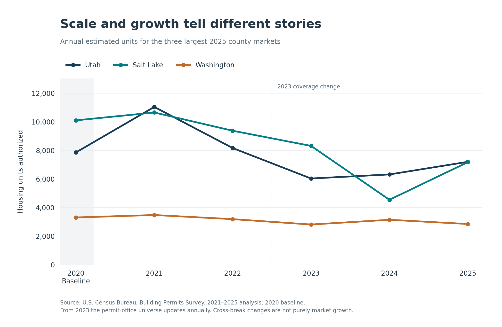
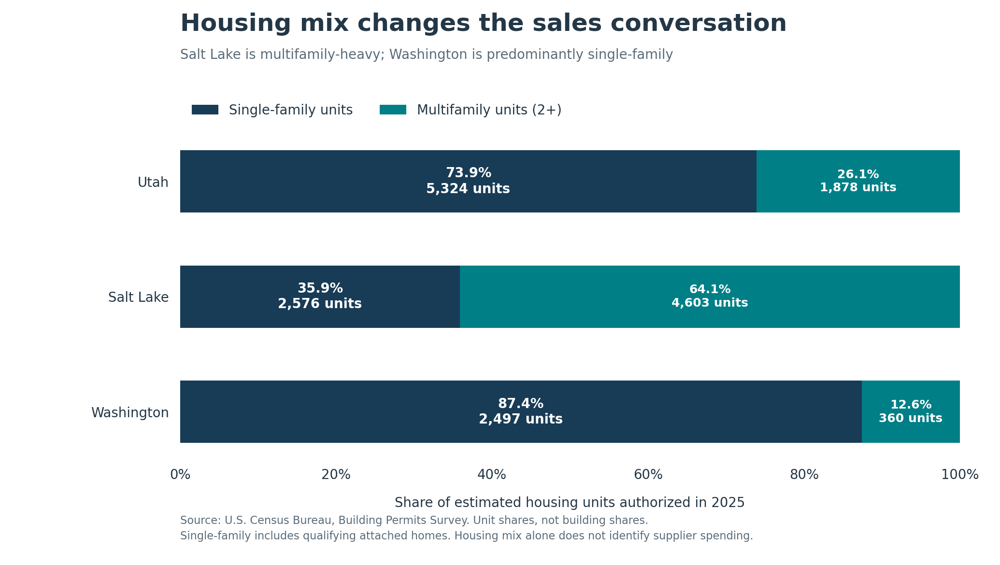

# Findings and recommendation

## A concentrated market

Utah counties authorized **26,775 residential housing units in 2025**, compared with **23,902 in 2024**: an increase of **2,873 units, or 12.0%**. Utah County and Salt Lake County account for 53.7% of the 2025 total; adding Washington County brings the share to 64.4%.

The statewide recovery does not imply growth in every county. Washington, Weber, Summit, and Tooele each recorded fewer authorized units in 2025 than in 2024. Comparing both units and percentages prevents a small county's rapid percentage growth from dominating the market screen.

## Three counties to investigate

| County | Evidence | Commercial research implication | Question to resolve |
| --- | --- | --- | --- |
| Utah | 7,202 units in 2025; 5,324 single-family units; +881 units from 2024 | Investigate a large homebuilder-oriented customer base | Which builders, product categories, and delivery areas could the supplier serve competitively? |
| Salt Lake | 7,179 units; 64.1% multifamily; three-year annual average of 6,681 | Investigate multifamily developers and contractors as well as single-family builders | Does the 2025 rebound represent a durable customer pipeline or uneven project timing? |
| Washington | 2,857 units; 87.4% single-family; −295 units from 2024 | Investigate a substantial single-family market, with cautious demand assumptions | Have the recent declines changed builders' purchasing plans? |

A count of authorized units is an activity indicator. Different building types can have different supplier requirements, so equal unit counts do not establish equal revenue opportunities.

## Challenge the ranking

**Latest year versus recent average.** The same three counties remain the top three under the 2023–2025 average. Salt Lake moves ahead of Utah on this measure. The order is sensitive to the chosen period; the three-county membership is stable under these two definitions.

**Total units versus single-family units.** Utah, Salt Lake, and Washington also remain the top three in 2025 single-family units. Outside the shortlist, Cache rises ahead of Davis and Weber on single-family volume. Customer specialization therefore matters even when the first three names remain unchanged.

**Multifamily and growth objectives.** Davis replaces Washington in the top three when ranking either 2025 multifamily units or absolute unit growth from 2024 to 2025. Percentage growth over that same year selects Uintah, Daggett, and Salt Lake. These alternatives answer different questions; the primary shortlist is deliberately based on current activity volume. The complete [sensitivity table](../reports/ranking_sensitivity.csv) reports the alternative rankings.

**Activity versus data composition.** Weber's 2025 imputed unit share is 43.3%, compared with less than 1% for each shortlisted county. This is a reason to inspect local reporting context before leaning heavily on the comparison. It is not a confidence score, and reported-only totals would omit imputed activity rather than provide a complete alternative estimate.

## What to do next

Begin customer and competitor research in the three shortlisted counties. Build a list of potential buyers by housing segment, estimate delivery and service costs, and test the product categories relevant to those buyers. Compare those findings with branch costs before considering an expansion commitment.

Keep Davis as a secondary market to investigate: it ranks fourth in 2025 total units, with 1,917 units and growth of 449 units from 2024. This project does not measure whether any one county offers better margins or lower competition.

## Evidence and limits

All figures derive from the preserved annual Census Building Permits Survey files in this repository. The [methodology](methodology.md) describes the calculations and the [validation report](validation.md) describes the checks. The 2023 coverage change is marked in the trend discussion; permit authorizations may not become completed housing, and dollar values are nominal permit valuations.

